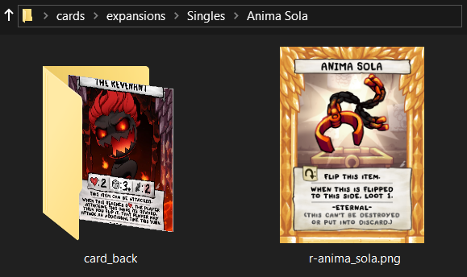

<div align="center"></div>
<h1 align="center">Four Souls MPC Formatter v1.0.0</h1>

**Four Souls MPC Formatter** is a program to format your locally downloaded, print-ready [Four Souls](https://foursouls.com) cards into XML files. These files are then fed into [mpc-autofill](https://github.com/chilli-axe/mpc-autofill) to ✨automagically✨ fill out your [_MakePlayingCards_](https://www.makeplayingcards.com/) order.

### Standing on the Shoulders of Giants

_mpc-autofill_ was originally designed for handling _Magic: The Gathering_ cards, but thanks to its powerful automation, we can use the same process to make printing _Four Souls_ cards just as easy.

## Contents

1. [Getting Started](#getting-started)
2. [How to Format Card Directories](#how-to-format-card-directories)
3. [How to Create Double-Sided Cards](#how-to-create-double-sided-cards)
4. [FAQ](#faq)
5. [Additional Questions](#additional-questions)
6. [Attributions](#attributions)
7. [Logo License](#logo-license)
8. [License](#license)

## Getting Started

This section provides an overview of how to set up and use _Four Souls MPC Formatter_. It will guide you through downloading the necessary programs, organizing your working directory, and adding your downloaded _Four Souls_ cards to directories. By following these steps, you'll be able to generate XML order files and use _mpc-autofill_ to prepare your cards for printing through _MakePlayingCards_.

This setup will guide you as though you're using the default directories and file names on a Windows OS.

1. **Set Up a Working Directory**

   - Create a new directory where you'll store your downloaded cards, necessary programs, config files, and output files in order to use _Four Souls MPC Formatter_.

```
my-working-directory/
```

2. **Download _Four Souls MPC Formatter_ into your Working Directory**
   - Download the [latest version](https://github.com/bfrymire/four-souls-mpc-formatter/releases/latest) from the Releases tab and place it in your working directory.

```
my-working-directory/
├── four-souls-mpc-formatter.exe
```

3. **Run _Four Souls MPC Formatter_ to Create Config File and Directories**

   - Run the `four-souls-mpc-formatter.exe` program.
     - The config file will be created automatically if it's missing.
       - If you ever need to reset it, select the `Reset Config File to Default` option.
     - Select the `Create Working Directories` option to create the directories.

```
my-working-directory/
├── cards/
│   ├── card_backs/
│   ├── expansions/
│   │   ├── Singles/
├── orders/
├── config.json
├── four-souls-mpc-formatter.exe
```

4. **Download Standard Print-Ready _Four Souls_ Card Backs**

   - The card back image files needed to print _Four Souls_ cards are not included here. They can be downloaded from the [Four Souls Templates Google Drive](https://drive.google.com/drive/u/0/folders/1b9iAG4i-SjnryKLiNMAKW8XFxeBt1Wjz).
   - Once downloaded, move the card back image files into `cards/card_backs/`.
   - The `four-souls-mpc-formatter.exe` program relies on the names in the `config.json` file to match up with the card back image files when generating the order files. These must match up either way, so you have two options:
     1. Edit the `config.json` file to have the downloaded card back file names.
     2. Rename the card back image files based on the default config file names.
        - Make sure to preserve your file types when renaming the files. _(e.g., `.jpg`, `.png`)_

**`config.json` Default Card Back File Names**

| Card Type                      | File Name                   |
| ------------------------------ | --------------------------- |
| Bonus Soul                     | bonus_soul_card_back.jpg    |
| Character                      | character_card_back.jpg     |
| Loot                           | loot_card_back.jpg          |
| Monster                        | monster_card_back.jpg       |
| Room                           | room_card_back.jpg          |
| Starting Item _(Eternal Item)_ | starting_item_card_back.jpg |
| Treausre                       | treasure_card_back.jpg      |

```
my-working-directory/
├── cards/
│   ├── card_backs/
│   │   ├── bonus_soul_card_back.jpg
│   │   ├── character_card_back.jpg
│   │   ├── ...
│   ├── expansions/
├── orders/
```

5. **Download _mpc-autofill_**
   - Download the [latest version of _mpc-autofill_](https://github.com/chilli-axe/mpc-autofill/releases/latest).
   - Place the `autofill-windows.exe` program in the `orders/` directory.

```
my-working-directory/
├── cards/
├── orders/
│   ├── autofill-windows.exe
```

6. **Download Print-Ready _Four Souls_ Cards**
   - Download your favorite print-ready _Four Souls_ cards and move them to `cards/expansions/` into their own directory.
   - Organize cards within each expansion folder by card types _(e.g., `loot/`, `treasure/`)_ recognized by vanilla _Four Souls_. Follow the [How to Format Card Directories](#how-to-format-card-directories).
   - For cards that have unique backs, follow [How to Create Double-Sided Cards](#how-to-create-double-sided-cards).

```
my-working-directory/
├── cards/
│   ├── card_backs/
│   ├── expansions/
│   │   ├── My Favorite Four Souls Cards/
│   │   │   ├── loot/
│   │   │   ├── treasure/
│   │   │   ├── ...
├── orders/
```

7. **Run _Four Souls MPC Formatter_**
   - You should now be ready to run the formatter to create the order files.
   - Run the `four-souls-mpc-formatter.exe` program.
   - Select the `Generate MPC Order Files` option.
   - After running the program, you should see your XML order files created in `orders/`.

```
my-working-directory/
├── cards/
├── orders/
│   ├── autofill-windows.exe
│   ├── order_Base_Card_Types_loot.xml
│   ├── order_Base_Card_Types_treasure.xml
│   ├── ...
```

8. **Run _mpc-autofill_**
   - Run the _mpc-autofill_ `autofill-windows.exe` program from within the `orders/` directory, as it searches for XML files in the same location.
   - Follow the on-screen prompts.
     - ⚠️ **Important!** ⚠️ The color correction settings provided by [Print Four Souls](https://printfoursouls.com/) were specifically tested for _MakePlayingCards_. If you're using a different print service, results may vary. When choosing _"Which site should the tool auto-fill your project into?"_, make sure to select _MakePlayingCards_.

```
my-working-directory/
├── cards/
├── orders/
│   ├── autofill-windows.exe
│   ├── order_Base_Card_Types_loot.xml
│   ├── order_Base_Card_Types_treasure.xml
│   ├── ...
```


9. **Review Your Order**

   - Once _mpc-autofill_ has finished filling out the card fronts and backs, carefully review the **Preview & Add to Cart** step to ensure all cards are correctly formatted.

10. **Update Your _MakePlayingCards_ Cart**

- _mpc-autofill_ has default settings it selects on _MakePlayingCards_:
  - **Card Stock:** _(M31) Linen_
  - **Card Finishing:** _MPC game card finish_
- Once the order is in your cart, update the **Card Finishing** setting.
- Based on [Print Four Souls](https://printfoursouls.com//) recommendations, change **Card Finishing** to **BETA playing card finish**.


11. **Complete Order!**

- Now, finalize your _MakePlayingCards_ order. Happy printing!

## How to Format Card Directories

To ensure that _Four Souls MPC Formatter_ correctly processes your cards, you need to organize them into specific directories based on their card type. The default card types recognized by vanilla _Four Souls_ are:

- Bonus Soul
- Character
- Loot
- Monster
- Room
- Starting Item _(also commonly referred to as Eternal Item)_
- Treasure

Each card type should be placed in its corresponding directory within an expansion folder. This ensures that the generated order files correctly group card types for printing.

### Example Directory Structure

When organizing your expansion, follow this structure:

```
my-working-directory/
├── cards/
│   ├── card_backs/
│   ├── expansions/
│   │   ├── My Favorite Four Souls Cards/
│   │   │   ├── bonus_soul/
│   │   │   ├── character/
│   │   │   ├── loot/
│   │   │   ├── monster/
│   │   │   ├── room/
│   │   │   ├── starting_item/
│   │   │   ├── treasure/
│   │   ...
├── orders/
```

In this example, the expansion _"My Favorite Four Souls Cards"_ contains seven subdirectories, each corresponding to a _Four Souls_ card type.

### Notes on Formatting

- **Folder name letter cases do not matter**, `Starting Item/` and `starting_item/` will both be recognized as the same card type.
- **Use "Starting Item" and not "Eternal Item"** when creating a card type folder for a character's initial item.
- **Do not mix card types** within the same folder. Each card type must have its own folder.
- **File names do not matter**, but using a consistent naming convention is recommended.
- **Use unique file names** across all cards. _mpc-autofill_ may not properly fill out card slots that are using the same file name.
- If an expansion **does not include** a certain card type, simply leave that folder out.

Following this structure ensures that _Four Souls MPC Formatter_ can properly group and process your cards when generating order files.

If your card(s) need a custom card back, continue reading [How to Create Double-Sided Cards](#how-to-create-double-sided-cards).

## How to Create Double-Sided Cards

To create double-sided cards, you need to group card fronts with their corresponding card back in a dedicated folder inside the `cards/expansions/Singles/` directory.

### Steps:

1. Inside `cards/expansions/Singles/`, create a **new folder** with a descriptive name for your set of double-sided cards.
2. Place all **card front images** inside this folder. All cards in this folder will share the same card back.
3. Inside this folder, create a `card_back/` directory.
4. Place the **card back image** inside `card_back/`.

### Example Directory Structure

```
my-working-directory/
├── cards/
│   ├── card_backs/
│   ├── expansions/
│   │   ├── Singles/
│   │   │   ├── Anima Sola/
│   │   │   │   ├── card_back/
│   │   │   │   │   ├── r-the_revenant.png
│   │   │   ├── r-anima_sola.png
```



## FAQ

##### **Q:** Does this color correct my _Four Souls_ cards?

**A:** No, this tool is only for streamlining the process of creating your _MakePlayingCards_ order.  
For color correction, follow the method outlined on [Print Four Souls](https://printfoursouls.com/).

##### **Q:** Where can I get print-ready card backs?

**A:** You can download them from the [Four Souls Templates Google Drive](https://drive.google.com/drive/u/0/folders/1b9iAG4i-SjnryKLiNMAKW8XFxeBt1Wjz).

##### **Q:** Will this work on macOS or Linux?

**A:** Not at this time. Windows is the only supported OS.

##### **Q:** I need help with mpc-autofill. Where should I go?

**A:** Check out the [_mpc-autofill_ repository](https://github.com/chilli-axe/mpc-autofill) for further support and documentation. The _mpc-autofill_ tool we're using is the desktop-tool.

##### **Q:** Can I use custom card backs?

**A:** Yes! Place them in `cards/expansions/Singles/<Your Expansion Name>/card_back/`.  
For more details, check out [How to Create Double-Sided Cards](#how-to-create-double-sided-cards).

## Additional Questions

Have any questions? [Create a new issue!](https://github.com/bfrymire/four-souls-mpc-formatter/issues/new)

## Attributions

A huge thanks to the following projects and their contributors:

- [Print Four Souls](https://printfoursouls.com/) for their work in refining a color-accurate method for printing _Four Souls_ cards.
- [mpc-autofill](https://github.com/chilli-axe/mpc-autofill) for handling the automation of order filling, making the process seamless.

## Logo License

The logo for the project has a separate [Logo License](./LICENSE_LOGO).

## License

[MIT License](./LICENSE)
